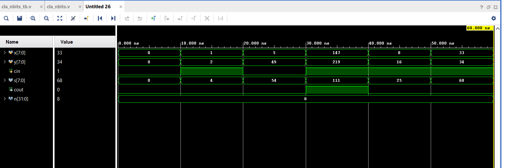

# 🧠 Verilog Lab — Digital Design Playground

**Digital design projects and testbenches in Verilog — from basic gates to custom multipliers.**

---

## 📂 What’s inside?

A collection of Verilog modules and their testbenches created as part of my learning in digital system design. Includes:

- Logic gates and multiplexers  
- Adders, subtractors, and simple ALUs  
- Sequential blocks like registers and counters  
- An 8-bit array multiplier (structural + behavioral)  
- Fully automated testbenches and screenshots of waveforms

---

## 🔬 Module Simulations

### 🧮 n-bit Carry Lookahead Adder
📌 The waveform below shows transitions for multiple test cases. A few representative ones are listed below for reference.
- Here n = 8 (As you can noted in the testbench).
| x | y | cin | Sum | Cout |
|---|---|-----|-----|------|
| 0 | 0 |  0  |  0  |   0  |
| 1 | 2 |  1  |  4  |   0  |
| 147 | 219 | 1 | 111 | 1 |

---

## 🚀 How to simulate (using Vivado)

1. Open **Vivado** (tested with Vivado 2019.1)
2. Create or open a Vivado project
3. Add the Verilog design files and their corresponding testbenches
4. Set the testbench file as the **Top Module**
5. Run **Behavioral Simulation**
6. View waveforms directly in the Vivado Simulator

> ⚠️ Designs may not be portable to Icarus Verilog due to tool-specific features or Xilinx primitives.

---

## 🛠 Tools Used

**Vivado 2019.1**
All modules and simulations are designed and tested using Vivado 2019.1.
Compatibility with newer versions is not guaranteed.

---

## 🙌 Contributions

Feel free to fork the repo and add your own modules or improve existing testbenches.  
If you spot an issue or want to suggest an improvement, open an issue or PR anytime!

---

## 📜 License

This project is licensed under the **MIT License**.  
Feel free to use, modify, and distribute — just keep the original license in place.

---

## ✨ Author

Shlok Khandelwal  
`2nd-year ECE | Digital Design & Verilog Enthusiast`  
**Built from gates, grounded in curiosity.**
